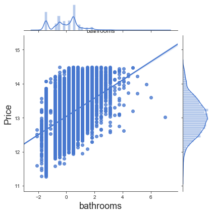

# Module 2 Final Project - Stephen Turk's Readme


## Introduction

For this project we will be using the King's County Home data set to create a linear regression model that accurately (r2 higher than .65) predicts home prices. Our stakeholders for this project are homeowners looking to sell their home and wanting to know what steps to take to change increase their home sale price.

Before we know all the best questions to ask on behalf of our shareholders we will first do some exploration of the data set as well as making it more easily used for linear regression.
### Imports

For this project this is the imports we will be using:
```python
import pandas as pd
import matplotlib.pyplot as plt
import numpy as np
import seaborn as sns

%matplotlib inline
plt.style.use('seaborn-muted')
sns.set_style('ticks')
import statsmodels.api as sm
from statsmodels.formula.api import ols
from statsmodels.stats.outliers_influence import variance_inflation_factor
import scipy.stats as stats
from sklearn.linear_model import LinearRegression
from sklearn.model_selection import cross_val_score
from sklearn.model_selection import train_test_split
from sklearn.metrics import r2_score, mean_squared_error
```
### Data
data = pd.read_csv('kc_house_data.csv') #This is the only dataset for this project

## Data Cleaning

### Dropping columns
Droping columns that showed little correllation and from the column descriptions only seemed moderately useful. Date sold might be useful in terms of sesason or important to adjust for if the time period in the data was a bit longer.

### Fixing null values
Waterfront needs some data added, but because this data seems categorical (either waterfront or not) I will assume that any missing data most likely was houses that were not on the waterfront. Similarly, SqFt Basement needs to be cast as a float and I will assume a lack of data suggests no basement square-footage.

#### Casting yr_renovated into boolean renovated
I will cast the column as a boolean in order to give a renovated or not column instead of a date renovated. A house renovated in 2015 is not two-thousand "more renovated" than a house that has not been renovated. I'll then cast the column back to integer, but having replaced independent dates with simply a 1 for renovated and a 0 for not renovated.


## Data Exploration

### 3 Central Questions
1  What are the most salient features of a house that can be changed in order to impact sale price?
2  Which immutable features of the house (location, year built) will most drastically impact sale price?
3  Will investment in the aspects of the house that are changible be cost effective?

#### Histogram
A histogram gives us a quick and dirty look at each column to see how it is distributed. Waterfront and now Renovated are both basically boolean values. A home is either renovated or not, waterfront or not.

Condition, Floors, Grade and Zipcode are likely all categorical variables (Zipcode doesn't look like it, but we already know that zipcode numbers do not reference a specific numerical value).

The historgram also gives us an idea of columns that likely have major outliers. bedrooms, price, sqft_above, sqft_basement, sqft_living, sqft_lot and sqft_lot15 are all very skewed graphs.

#### Removing Outliers
Now we know that the upper 1% of prices are houses over $1,970,000. We will remove these high priced outliers and see if this improves our distribution.

#### Jointplot - Checking for linearity
Use a jointplot to check for linear features. Also, these plots will be useful later on for visuals for stakeholders.

#### One-hot Encoding Categorical Variables
Looking for catagorical variables to one-hot encode:

While we stated above that condition, floors, and grade were all likely categorical after looking them further it seems more likely that these features are still numeric and not necessary to change. This leaves zipcode as our diffinitively categorical variable.

#### Log Tranformation
Our data still has some outliers on price and linearity seems to be less reliable as prices increase. A log tranformation will help bring the data more in line with normal.

## Fitting the Model
### Hypothesis
Before we get a model we should have an idea what we are expecting to see as well as a null hypothesis that we are hoping to reject. In our case, our expectation is that changes in the values of our columns will correllate to changes in our housing prices.

In order to be more exact in our hypotheis we will choose a stardard value for 𝛼, .05. Meaning that we will only reject the null hypothesis if there is less than a 5% chance our observed changes came from random chance. Therefore our null hypothesis would be that changes in our features do not effect price.

#### Hypothesis
𝐻1: Predicted data ≠ μ (mean)

𝐻0: Predicted data = μ (mean)
### Train/Test Split
We split the data into 80% train data for building the model and leave out 20% test data to test our model against when we are done.

### Fitting the train data

We use statsmodels linear regression model to fit the data.

### Removing non-influencial features

Our R2 score is not too bad, but we have lots of columns and many have far too high of a P score. Let's remove any column that has a p score over .05. In other words any column that is unlikely to be cotributing to our final predictions.

### Checking for Multicollinearity

Using variance inflation factor to remove multicollinear features. Finding out each columns VIF score then remove VIF scores higher than 5. Then refit the model with the new features.
### Normality Check

Our model is still in good shape after these checks. Let's do some quick checks into normality and homoscedasticity to make sure our residuals aren't too far outside of normal, or patterned in a way that an alternative model might be more efffective.
The log tranform really helps with normality. In our case we still have some abnormality at high and low price values, but especially within quantiles -2 through 2 our data is looking pretty good.

Future models might look at breaking out predictions for high and low values and removing those factors from the model. In this case I think it's better to keep our outlier elmination to only removing 1% of data.
### Homoscedasticity Check
We are looking to see if there are any obvious patterns to where our errors occur. A generally shapeless blob is the goal here.
Good news, it looks like there might be some funneling toward the higher prices, but there is no strong hetroscedasticity.

## Analysis
### Question #1 What are the most salient features of a house that can be changed in order to impact sale price?
This can seem inscrutable, but we know that all features related to zipcode are not something our home owners can change, latitude is similarly immutable. So that makes sqft_living the most significant, changeable, feature of our home price model, followed by grade and condition.

These are very useful insights because they are a good combination of expected (square footage increases lead to an increase in home price) and less expected (2 subjective rating categories).



### Question #2 Which immutable features of the house (location, year built) will most drastically impact sale price?
As we saw when sorting our parameters, features related to location were extrememely important. Specifically the zipcodes:98039 and 98004 were strongly correllated with higher property values while 98019 and 98133 were correllated with the lower property values. Latitude and Waterfront properties were also correllated with higher property values.
While our stakeholders can't change these facets of their property, they can be aware that these immutable features are going to play a role in their home sale price and will help explain whether they should attempt to sell for a premium if they are in a preferred zipcode or accept less if they live in a non-preferred zipcode.

### Question #3 Will investment in the aspects of the house that are changible be cost effective?
The good news for this section is that those features of the model that can be changed offer a wide variety of options. While it is somewhat common knowledge, adding squarefootage is the most direct feature that can impact sale price. According to our model an increase of 1 standard deviation of square footage (918 sqft) will result in a 18% increase in property value. For a 500000 dollar house this would be a $9000 increase in value. The Condition and Grade features are harder to exactly quantify because they rely on a subjective rating, but the King's County website explains that the grade feature looks into quality of construction, quality of materials and overall workmanship on the house. Combining this with what we know about square footage, it is more worthwhile to have high quality expansion work done because this would see an increase to all 3 important features instead of just one.

## Conclusion
We have created a model that does a good job of predicting home prices given a sample set of data and features. For our stakeholders, the model is able to recommed features that can be changed in a home to increase value (SqFt living, Grade, Condition) while also identifying that there is no magic bullet as property values a still significantly impacted by unchangable aspects of the property. High value zipcodes, position and waterfront property still command higher prices.

These recommendations would be even more significant for a stakeholder looking to buy a house, or an investor trying to invest in multiple properties. However, for the given stakeholders there are still actionable items like adding square footage, using quality workers and materials as well as simply knowing the value of the location that they are selling from in order to accurately price their house for the market.

## Future Steps
In the future it would be great to look more specifically at certain price categories of houses to see if certain features are more important to expensive or cheap houses. I would imagine a more accurate model could be made for categorized housing prices, and for sellers it would be advantageous to fit a model to their specific price range instead of all houses sold (overfitting might be more of problem if using this strategy).